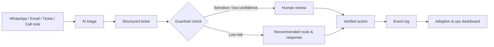

# PAYG Ops Copilot

**AI-first support triage and operations analytics prototype**  
Built as an independent case study for an Associate Product Manager — Digitization & Automation role.  
**Candidate:** Varsha Panguluri

**Live demo:** https://varsha1005.github.io/payg-ops-copilot/  
**GitHub repository:** https://github.com/varsha1005/payg-ops-copilot

> This project uses synthetic data only and is not an official Sun King product. Assumptions about internal workflows are hypotheses based on public information and the role description.

## The problem

PAYG solar operations combine recurring payments, field service, customer support and internal agent workflows. Public Sun King information explains that EasyBuy customers can pay through mobile money or cash and receive codes that keep their products active. A large field-agent/service network makes fast, consistent issue handling important.

Support messages are often unstructured:

> “I paid this morning but it is not showing and I did not receive the unlock code.”

Before anyone can solve that issue, somebody has to read it, summarize it, decide urgency, find the right owner, choose the next step and reply. That first-pass work is repetitive, but it cannot be blindly automated because payment, identity and fraud cases need verification.

## What I built

PAYG Ops Copilot turns an incoming message into:

- Short summary
- Issue category
- Priority
- Owner team
- Recommended next action
- Draft response
- Confidence score
- Human-review flag

It also includes:
- Batch CSV triage
- Operations/adoption dashboard
- SQL analysis queries
- Unit tests
- Human-in-the-loop guardrails
- Product brief, PRD and rollout plan
- Optional LLM API mode + no-key demo mode

## Why this is AI-first

I did not begin with a long PRD. I first asked whether an LLM could remove the repeated interpretation step in a real workflow, then built the smallest working prototype around that hypothesis.

The product uses AI for ambiguity (summarization, intent, routing suggestions) and uses deterministic controls for safety. AI is a **copilot**, not the source of truth for money movement or identity changes.

## Workflow



## Try it locally

```bash
python -m venv .venv
# Windows: .venv\Scripts\activate
# macOS/Linux: source .venv/bin/activate
pip install -r requirements.txt
streamlit run app.py
```

The default **Demo mode** works without any API key.

### Optional real LLM mode

Copy `.env.example` values into your environment or deployment secrets:

```text
LLM_API_KEY=...
LLM_MODEL=...
LLM_API_URL=https://api.openai.com/v1/chat/completions
```

The adapter expects an OpenAI-compatible chat-completions JSON response. In a production build I would use a provider abstraction and structured-output validation rather than coupling the product to a single model.

## Safety boundaries

The copilot can summarize, classify, route and draft. It cannot:
- Confirm a payment without checking the source system.
- Issue refunds or credits.
- Change customer identity/profile data automatically.
- Handle suspected fraud/safety cases without a human.

## Metrics I would use in a pilot

**Adoption:** AI triage usage %, weekly active support users, adoption by market/channel.  
**Quality:** routing accuracy, human override rate, unsafe-response rate, reopen rate.  
**Efficiency:** time to routed ticket, time to first useful response, backlog >24h.  
**Outcome:** resolution time and repeat-contact rate.

## Repository structure

```text
app.py                         Streamlit prototype
src/triage.py                  demo + LLM triage logic and guardrails
src/analytics.py               dashboard metric calculations
data/synthetic_tickets.csv     synthetic operating dataset
data/batch_input_example.csv   sample batch upload
sql/product_usage_queries.sql  SQL for adoption/quality/ops metrics
tests/test_triage.py           basic safety and routing tests
docs/PRODUCT_BRIEF.md          problem, users, scope, metrics, risks
docs/PRD.md                    requirements and acceptance criteria
docs/TEST_AND_ROLLOUT_PLAN.md  rollout sequencing and launch gates
docs/AI_EXPERIENCE_SUMMARY.md  candidate AI background + evidence
docs/DECISION_LOG.md           key product tradeoffs
```

## What I would validate with real stakeholders

1. Actual top support intents and language mix by market.
2. Current routing rules, SLAs and escalation ownership.
3. Which APIs/source systems can verify payment, code and account state.
4. PII handling and retention requirements.
5. Connectivity constraints for field teams.
6. Baseline handling time before claiming any efficiency improvement.

## Public context used

- Sun King payment options / EasyBuy: https://sunking.com/payment-options/
- Sun King company site: https://sunking.com/
- Sun King careers / operating context: https://sunking.com/work-with-us/

## Key takeaway

The prototype is intentionally small. The product idea is not “use AI everywhere”; it is to automate the repetitive interpretation layer, keep sensitive actions grounded in verified systems, and measure whether the tool actually improves operations.
